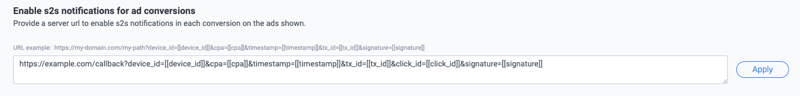

# Magic Receipts iOS SDK

# Prerequisites

* Use XCode 12 or higher
* Target iOS 11.0 or higher

<br/>

# Quick Guide

1. [Create a Pollfish Developer Account](#1-create-a-pollfish-developer-account)
2. [Register a new App on Pollfish Developer Dashboard and copy the given API Key](#2-register-a-new-app-on-pollfish-developer-dashboard-and-copy-the-given-api-key)
3. [Enable Magic Receipts in your account](#3-enable-magic-receipts-in-your-account)
4. [Download and import Magic Receipts framework into your project](#4-download-and-import-magic-receipts-framework-to-your-project)
5. [Import Magic Receipts module](#5-import-magic-receipts-module)
6. [Configure and initialize Magic Receipts SDK](#6-configurae-and-initialize-magic-receipts-sdk)

Optional

7. [Listen for Magic Receipts lifecycle events](#7-listen-for-magic-receipts-lifecycle-events)
8. [Control the SDK](#8-control-the-sdk)
9. [Configure postbacks](#postbacks)

<br/>

# Detailed Steps

## 1. Create a Pollfish Developer Account

Register as a Publisher at [pollfish.com](https://pollfish.com/login/publisher)

<br/>

## 2. Register a new App on Pollfish Developer Dashboard and copy the given API Key

Login at [www.pollfish.com](https://pollfish.com/login/publisher) and click "Add a new app" on Pollfish Developer Dashboard. Copy then the given API key for this app in order to use later on, when initializing Pollfish within your code.

<br/>

## 3. Enable Magic Receipts in your account

In your App setting scroll till you find the **Ads in survey end pages** and enable the feature switch. 


<br/>

## 4. Download and import Magic Receipts framework to your project

You can use one the following methods do download and integrate the Magic Receipts SDK into you project

<br/>

### **CocoaPods** (Coming soon)

Add a Podfile with Magic Receipts framework as a pod reference:

```ruby
pod 'MagicReceipts'
```

You can find latest Magic Receipts iOS SDK version on CocoaPods [here](https://cocoapods.org/pods/MagicReceipts)

Run `pod install` on the command line to install the Magic Receipts pod.

<br/>

### **Swift Package Manager** (Coming soon)

In Xcode, install the Magic Receipts iOS SDK Swift Package by navigating to File > Add Packages....

In the prompt that appears, search for the Magic Receipts iOS SDK Swift Package GitHub repository:

```
https://github.com/pollfish/ios-sdk-magic-receipts.git
```

Select the version of the Magic Receipts iOS SDK you want to use. For new projects, we recommend using the Up to Next Major Version.

Once you're finished, Xcode will begin resolving your package dependencies and downloading them in the background. For more details on how to add package dependencies, see [Apple's article](https://developer.apple.com/documentation/swift_packages/adding_package_dependencies_to_your_app).

> **Note:** If you are migrating from a CocoaPods-based project, run `pod deintegrate` to remove CocoaPods from your Xcode project. The CocoaPods-generated .xcworkspace file can safely be deleted afterward. If you're adding the Magic Receipts iOS SDK to a project for the first time, this step can be ignored.

<br/>

### **Manual integration**

Clone the Magic Receipts iOS SDK repository and then in Xcode, select the target that you want to use and in the Build Phases tab expand the Link Binary With Libraries section. Press the + button, and press Add other… In the dialog box that appears, locate the MagicReceipts.xcframework and select it.  

The project will appear at the top of the Link Binary With Libraries section and will also be added to your project files (left-hand pane).

Next, add the following Swift frameworks (if you don'y already have them) in your project

- AdSupport.framework  
- CryptoKit (iOS 12 or lower)
- CommonCrypto (iOS 13 or higher)

<br/>

## 5. Import Magic Receipts module

You have to import Magic Receipts Module in any file that you will use Magic Receipts.

<span style="text-decoration: underline">Objective-C:</span>

```objc
@import MagicReceipts;
```

<span style="text-decoration: underline">Swift</span>

```swift
import MagicReceipts
```

<br/>

## 6. Configurae and initialize Magic Receipts SDK

A good place to call `MagicReceipts.init` function is in the application’s delegate `applicationDidBecomeActive` method or `viewDidLoad` or `viewWillAppear` methods of a `ViewController`.

In order to initialize, you need an instance of `Params` on which you will pass the API key of your app (step 2 above). `Params` has several parameters that affect the behaviour of Magic Receipts offer wall.

Below you can see an example on how you can initialize Magic Receipts with the help of `Params` object:

<br/>

<span style="text-decoration: underline">Objective-C:</span>

```objc
- (void) applicationDidBecomeActive:(UIApplication *)application 
{
    Params *params = [[Params alloc] init:@"API_KEY"];
    [params userId:@"USER_ID"];
    [MagicReceipts initializeWith:params delegate:self];
}
```

<span style="text-decoration: underline">Swift:</span>

```swift
func applicationDidBecomeActive(application: UIApplication) {
    let params = Params("API_KEY")
        .userId("USER_ID")
    
    MagicReceipts.initialize(with: params)
}
```

<br/>

You can set several params to control the behaviour of Magic Receipts survey panel within your app wih the use of `Params` instance. Below you can see all the available options.

No | Description
--- | -----
6.1 | **`.userId(String)`** <br/> A unique id to identify the user.
6.2 | **`.incentiveMode(Bool)`** <br/> Control the visibility of the Magic Receipts indicator.
6.3 | **`.clickId(String)`** <br/> A pass throught parameter that will be passed back through server-to-server [postback](#postbacks) to identify the click.

<br/>

### **6.1 `.userId(String)`**

A unique id to identify the user.

<span style="color: red">You can pass the id of a user as identified on your system. Magic Receipts will use this id to identify the user across sessions instead of an ad id/idfa as advised by the stores. You are solely responsible for aligning with store regulations by providing this id and getting relevant consent by the user when necessary. Magic Receipts takes no responsibility for the usage of this id. In any request from your users on resetting/deleting this id and/or profile created, you should be solely liable for those requests.</span>

<br/>

<span style="text-decoration: underline">Objective-C:</span>

```objc
Params *params = [[Params alloc] init:@"API_KEY"];

[params userId:@"USER_ID"];
```

<span style="text-decoration: underline">Swift:</span>

```swift
let params = Params("API_KEY")
    .userId("USER_ID")
```

<br/>

By skipping providing a `userId` value, the SDK will try to retrieve the IDFA of the device and use that in order to identify the user. In that case you should request for IDFA access permission prior to the SDK initialization.

To display the App Tracking Transparency authorization request for accessing the IDFA, update your `Info.plist` to add the `NSUserTrackingUsageDescription` key with a custom message describing your usage. Below is an example description text:

```xml
<key>NSUserTrackingUsageDescription</key>
<string>This identifier will be used to deliver personalized ads/surveys to you.</string>
```

To present the authorization request, call `requestTrackingAuthorization`. We recommend waiting for the completion callback prior to initializing.

<span style="text-decoration: underline">Objective-C:</span>

```objc
#import <AppTrackingTransparency/AppTrackingTransparency.h>
#import <AdSupport/AdSupport.h>

- (void) requestIDFA {
    [ATTrackingManager requestTrackingAuthorizationWithCompletionHandler:^(ATTrackingManagerAuthorizationStatus status) {
        // Initialize Magic Receipts here.
        [self initMagicReceipts];
    }];
}
```

<span style="text-decoration: underline">Swift</span>

```swift
import AppTrackingTransparency
import AdSupport

func requestIDFA() {
    ATTrackingManager.requestTrackingAuthorization { status in
        // Initialize Magic Receipts here.
        self.initMagicReceipts()
    }
}
```

<br/>

### **6.2. `.incentiveMode(Bool)`** 

Initializes Magic Receipts SDK in incentivised mode. This means that Magic Receipts Indicator will not be shown and the Magic Receipts offer wall will be automatically hidden until the publisher explicitly calls `.show()` function (The publisher should wait for the `wallDidLoad` callback). This behaviour enables the option for the publisher, to show a custom prompt to incentivize the user to participate.

<br/>

<span style="text-decoration: underline">Objective-C:</span>

```objc
Params *params = [[Params alloc] init:@"API_KEY"];

[params rewardMode:true];
```

<span style="text-decoration: underline">Swift:</span>

```swift
let params = Params("API_KEY")
    .incentiveMode(true)
```

<br/>

### 6.3. **`.clickId(String)`**

A pass through param that will be passed back through server-to-server [postbacks](#postbacks) in order to identify the click.

<br/>

<span style="text-decoration: underline">Objective-C:</span>

```objc
Params *params = [[Params alloc] init:@"API_KEY"];

[params clickId:@"CLICK_ID"];
```

<span style="text-decoration: underline">Swift:</span>

```swift
let params = Params("API_KEY")
    .clickId("CLICK_ID")
```

<br/>

# Optional section

## 7. Listen for Magic Receipts lifecycle events

In order to get notified for Magic Receipts lifecycle events you will have to comform to the `MagicReceiptsDelegate` and override the methods of your choice. All methods are optional.

Below you can see an example of comformance to the `MagicReceiptsDelegate`

<span style="text-decoration: underline">Objective-C:</span>

```objc
// ViewController.h

@interface ViewController : UIViewController<MagicReceiptsDelegate>

@end


// ViewController.m

@interface ViewController()

@end

@implementation ViewController

...

// Override here the methods of your choice

@end
```

<span style="text-decoration: underline">Swift:</span>

```swift
class ViewController: UIViewController {
   ...
}

extension ViewController: MagicReceiptsDelegate {
    // Override here the methods of your choice
}
```

Please make sure you pass the conforming class durring initialisation

<span style="text-decoration: underline">Objective-C:</span>

```objc
[MagicReceipts initializeWith:params delegate:self];
```

<span style="text-decoration: underline">Swift:</span>

```swift
MagicReceipts.initialize(with: params, delegate: self)
```

There are five methods available to override:

No | Delegate Method
------------ | -------------
7.1 | **`onWallDidLoad`** <br/> Get notified when the SDK has loaded
7.2 | **`onWallDidFailToLoad(error: MagicReceiptsLoadError)`** <br/> Get notified when the Magic Receipts has failed to load
7.3 | **`onWallDidShow`** <br/> Get notified when the Magic Receipts wall has opened
7.4 | **`onWallDidFailToShow(error: MagicReceiptsShowError)`** <br/> Get notified when the Magic Receipts wall has failed to show
7.5 | **`onWallDidHide`** <br/> Get notified when the Magic Receipts wall has closed

<br/>

### 7.1. Get notified when the SDK has loaded

You can get notified when the SDK has loaded via the `MagicReceiptsDelegate`.

<span style="text-decoration: underline">Objective-C:</span>

```objc
- (void) onWallDidLoad
{
    NSLog(@"Magic Receipts SDK loaded!")
}
```

<span style="text-decoration: underline">Swift:</span>

```swift
func onWallDidLoad() {
    print("Magic Receipts SDK loaded!")
}
```

<br/>

### 7.2. Get notified when the SDK has failed to load

You can get notified when the SDK has failed to load via the `MagicReceiptsDelegate`.

<span style="text-decoration: underline">Objective-C:</span>

```objc
- (void) onWallDidFailToLoadWith:(MagicReceiptsLoadError *)error
{
    NSLog(@"Magic Receipts wall did fail to load - %@", error);
}
```

<span style="text-decoration: underline">Swift:</span>

```swift
func onWallDidFailToLoad(error: MagicReceiptsLoadError) {
    print("Magic Receipts wall did fail to load - \(error)")
}
```

<br/>

### 7.3 Get notified when the Magic Receipts wall has opened

You can get notified when the Magic Receipts wall has opened via the `MagicReceiptsDelegate`.  

<span style="text-decoration: underline">Objective-C:</span>

```objc
- (void) onWallDidShow
{
    NSLog(@"Magic Receipts wall has opened!");
}
```

<span style="text-decoration: underline">Swift:</span>

```swift
func onWallDidShow() {
     print("Magic Receipts wall has opened!")
}
```

<br/>

### 7.4 Get notified when the Magic Receipts wall has failed to show

You can get notified when the Magic Receipts wall has failed to show via the `MagicReceiptsDelegate`.  

<span style="text-decoration: underline">Objective-C:</span>

```objc
- (void) onWallDidFailToShowWith:(MagicReceiptsShowError *)error
{
    NSLog(@"Magic Receipts wall did fail to show - %@", error);
}
```

<span style="text-decoration: underline">Swift:</span>

```swift
func onWallDidFailToShow(error: MagicReceiptsShowError) {
     print("Magic Receipts wall did fail to show - \(error)")
}
```

<br/>

### 7.5 Get notified when the Magic Receipts wall has closed

You can get notified when the Magic Receipts wall has closed via the `MagicReceiptsDelegate`.  

<span style="text-decoration: underline">Objective-C:</span>

```objc
- (void) onWallDidHide
{
    NSLog(@"Magic Receipts wall closed!");
}
```

<span style="text-decoration: underline">Swift:</span>

```swift
func onWallDidHide() {
     print(""Magic Receipts wall closed!")
}
```

<br/>

## 8. Control the SDK

### 8.1. Manually show/hide Magic Receipts views

You can manually hide or show Magic Receipts offer wall or indicator by calling the following methods after initialization:  

#### 8.1.1. Show

<span style="text-decoration: underline">Objective-C:</span>

```objc
[MagicReceipts show];
```

<span style="text-decoration: underline">Swift:</span>

```swift
MagicReceipts.show()
```

#### 8.1.2. Hide

<span style="text-decoration: underline">Objective-C:</span>

```objc
[MagicReceipts hide];
```

<span style="text-decoration: underline">Swift:</span>

```swift
MagicReceipts.hide()
```

<br/>

### 8.2. Check if Magic Receipts SDK is ready

At anytime you can check whether the Magic Receipts SDK is ready to show the wall or not.

<span style="text-decoration: underline">Objective-C:</span>

```objc
[MagicReceipts isReady];
```

<span style="text-decoration: underline">Swift:</span>

```swift
MagicReceipts.isReady()
```

<br/>

# Postbacks

You can easily setup postbacks in order to receive a notifications when a conversion has happened.

## 9.1. Configure your Postback URL

You can set a Server-to-Server webhook URL through Pollfish developer dashboard, in your app's page. On every conversion we will perform a HTTP GET request to this URL.



<br/>

> **Note:** You should use this call to verify a conversion if you reward your users for their action. This is the only 100% accurate and secure way to monitor conversions through your app.

<br/>

Server-to-server callbacks can be used to retrieve several information regarding a conversion. Below there is a list of all the available tempate params you can use to configure your Postback URL.

Parameter name | Type | Description
---------------|------|------------
click_id       |String| The pass-through parameter used to identify the click
cpa            |Int   | Money earned from conversion in USD
device_id      |String| User/Device identifier
timestamp      |Long  | Transaction timestamp
tx_id          |String| Unique transaction identifier
signature      |String| A Base64 Url encoded string securing the above parameters

<br/>

## 9.2. Uniquely identify a conversion and avoiding duplicates

Mistakes may happen, and you may receive multiple callbacks for the same conversion. You can avoid those duplicates by checking the tx_id param. This identifier is unique per conversion transaction.

<br/>

## 9.3. Secure your postbacks

You can secure your callback by adding the signature template parameter in your callback URL. In addition you will have to include at least one of the rest supported template parameters because signing is happening on the parameters and not on the url.

```
http://www.example.com/callback?tx_id=[[tx_id]]&time=[[timestamp]]&cpa=[[cpa]]&device=[[device_id]]&click_id=[[click_id]]&sig=[[signature]]
```

<br/>

### 9.3.1 How signatures are produced

The signature of the callback URLs is the result of appling the HMAC-SHA1 hash function to the [[parameters]] that are included in the URL using your account's secret_key.

We only sign the values that are substituted using the parameters placeholders `[[click_id]]`, `[[cpa]]`, `[[device_id]]`, `[[timestamp]]` and `[[tx_id]]`. We do not sign any other part of the URL including any other URL parameters that the publisher might specify.

Your secret_key is an auto-generated key by Pollfish that serves as a shared secret between the publisher and Pollfish. You can find out more about your secret_key at the Account Information page.

To sign the parameters they are assembled in alphabetical order using the parameter placeholder names in a string by concatenating them using the colon `:` character. For example if you have the follwing URL template:

```
https://www.example.com?device_id=[[device_id]]&cpa=[[cpa]]&timestamp=[[timespamp]]&tx_id=[[tx_id]]&click_id=[[click_id]]&signature=[[signature]]
```

with this as a secret key 

```
4dd95289-3961-4a1f-a216-26fa0f99ca87
```

Then the produced string, that will be the input to HMAC-SHA1, will have the pattern: 

```
click_id:cpa:device_id:timestamp:tx_id
```

Furthermore if we have the following values: `device_id=my-device-id`, `cpa=30`, `timestamp=1463152452308`, `click_id=a-unique-click-id` and `tx_id=123456789` the string that will be the input to HMAC-SHA1 will be:

```
a-unique-click-id:30:my-device-id:1463152452308:123456789
```

and the produced callback URL will be:

```
https://www.example.com?device_id=my-device-id&cpa=30&timestamp=1463152452308&tx_id=123456789&click_id=a-unique-click-id&signature=h4utQ%2Fi9u7VGTyf9BGi37A08cIE%3D
```

Please note that the string is created using the parameter values before they are URL encoded.

Additionally since `click_id` is an optional parameter that might be skipped during the SDK initialization and you have defined the corresponding template parameter in your callback URL, then it should be included in the signature calculation with an empty value, So your signing payload should match the following 

```
:30:my-device-id:1463152452308:123456789
```

<br/>

### 9.3.2 How to verify signatures

To verify the signature in server-to-server postback calls follow the below proceedure:

1. Extract the value of the signature parameter from the URL.
2. URL decode the value you extracted in (1) using Percent encoding
3. Extract the values of the rest of the parameters URL.
4. URL decode the values you extracted in (3) using Percent encoding.
5. Sort the values from (4) alphabeticaly using the names of the template parameters. The names of the template parameters in sorted order are: click_id, cpa, device_id, timestamp, tx_id and not the names of any URL parameters your URL may contain.
6. Produce a string by concatenating all non-empty parameter values as sorted in the previous step using the `:` character. The only parameter that when specified in the URL template can be empty is `click_id`. There is a special handling for term_reason: If the user is non-eligible then it has one of the values described in section 6 and with that value is included in the callback url and the signature calculation. If however the user is eligible the term is included but with an empty value and must participate in the signature calculation. An example of a callback url for an eligible user is https://mybaseurl.com?device_id=my-device-id&term_reason=&cpa=30 which gives the string 30:my-device-id: for signature calculation. The trailing : is because of the empty term_reason
7. Sign the string produced in (6) using the HMAC-SHA1 algorithm and your account's secret_key that can be retrieved from the Account Information page.
8. Encode the value produced in (7) using Base64. Please note that the input to the Base64 function must be the raw byte array output of HMAC-SHA1 and not a string representation of it.
9. Compare the values produced in (2) and (8). If they are equal then the signature is valid.

<br/>

## 9.4. Check postback logs

You can check logs from your s2s callbacks history simply by navigating to End Page Ads -> Monitoring page on your Dashboard.


In this page you will find all callbacks generated from Pollfish servers for your app, sorted by date. You can easily track the status of each call and response from you server side. Each call in the logs is clickable and you can also search for a specific callback based on specific params of your url structure.

